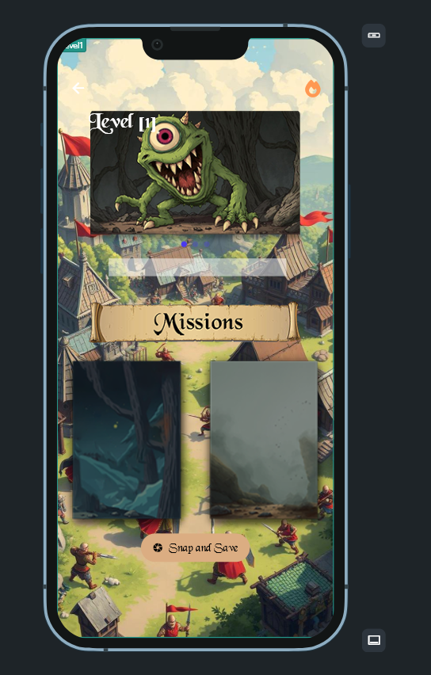
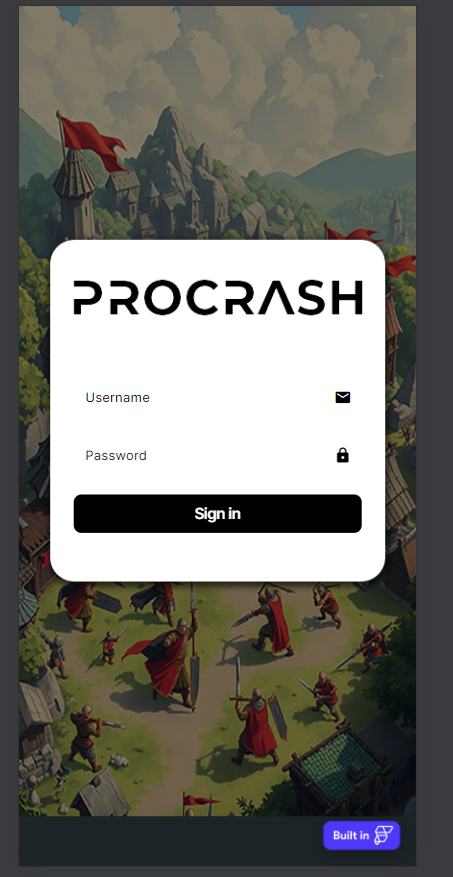
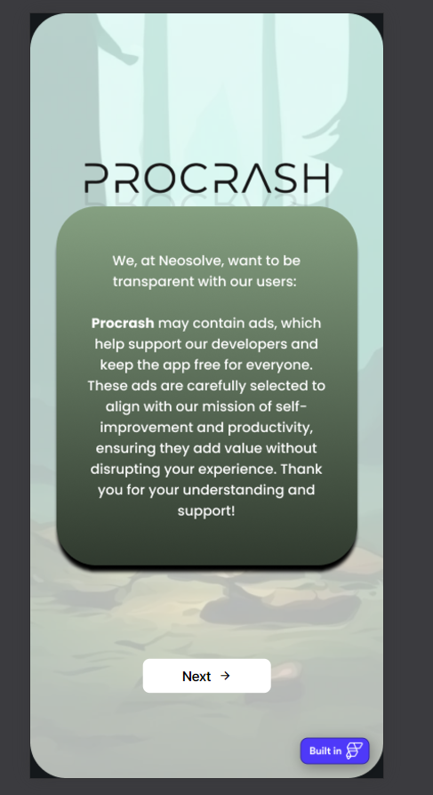

# Procrash  
*"Level up your life, one goal at a time."*

People tend to procrastinate because they don’t know how to do a certain task or where to start, which is why they keep delaying things. This is also supported by Parkinson’s Law, which states that "work expands to fill the time available for its completion," meaning that without clear deadlines or direction, tasks can feel overwhelming and are often put off indefinitely.

Procrastination isn’t just about laziness; it’s about the lack of structure, motivation, and emotional support. People struggle to break big goals into manageable steps and often feel defeated before they even start.

Meet **Procrash** is a gamified self-improvement app designed to help you overcome procrastination and achieve your personal goals. Inspired by popular card-based games like *Slay the Spire*, Procrash makes goal-setting and habit formation fun, interactive, and rewarding.  

## Features  
- **Gamified Goal Setting**  
  Break down your ultimate goals into manageable tasks (cards) and complete them to "damage" procrastination bosses.  
- **Boss Battles**  
  Face off against virtual "bosses" that represent procrastination. Each completed task reduces their health.  
- **Progress Tracking**  
  Track your daily and weekly progress to stay on top of your goals.  
- **Motivational Rewards**  
  Earn badges, streaks, and achievements to celebrate milestones.  
- **Personalized Notifications**  
  Get reminders to complete tasks and motivational messages to keep you going.  

## How It Works  
1. **Set Your Ultimate Goal**  
   Start by defining a big goal (e.g., "Drink 8 glasses of water daily").  
2. **Break It Down**  
   The app creates mini-goals in the form of cards, like "Drink 1 glass right now" or "Do 10 pushups."  
3. **Battle Procrastination**  
   Each time you complete a task, the procrastination boss loses health.  
4. **Celebrate Your Wins**  
   Defeat bosses, earn rewards, and set new goals to keep improving!  

## Screenshots  
  
  
  

## Tech Stack  
- **Frontend:** FlutterFlow  
- **Backend:** Firebase (Authentication, Firestore)  
- **Tools:** GitHub, VS Code  

## Website
Check out the app at 
https://procrash-hdps5h.flutterflow.app/
